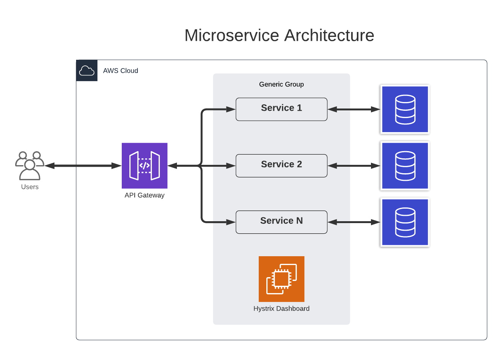

# Microservice Model

This project is a microservice model that may be used as a prototype for futures microservice projects. It has two microservices: Department and User. The root project is a Spring Boot project and the microservices are Spring Boot projects. On another word, each microservice Module is a submodule of the root project. Below you can see the final result.

```text
microservice (root project)
|   pom.xml
|   README.md
|
+---service-department (department microservice)
|   |   pom.xml
|   |   README.md
|   |
|   |
|   +---src (java code)
|
+---service-user (user microservice)
    |   pom.xml
    |   README.md
    |
    +---src (java code)
```

## Architecture



- Service Registry - All microservices are registered to the Service Registry. This serve manages all the service names and ports.
- API Gateway - It is a gateway for all APIs. All the requests should go to this API gateway. It is responsible to travel the request to the right API.
- Hystrix Dashboard - Manage all API. Identify which microservice is or not working.

## Settings

### 1. Libs

Create a new Spring Boot project with the dependencies below:
- Spring Web
- Spring Data JPA
- Spring Cloud
  - Eureka
- Lombok
- H2

###### Root project pow.xml

The root [pom.xml](/pom.xml) has the Spring Boot `parent` and `build` tags. Those tags allow Maven to import Spring Boot dependencies.
```xml
...
<parent>
    <groupId>org.springframework.boot</groupId>
    <artifactId>spring-boot-starter-parent</artifactId>
    <version>2.6.3</version>
    <relativePath/> <!-- lookup parent from repository -->
</parent>
...
<build>
    <plugins>
        <plugin>
            <groupId>org.springframework.boot</groupId>
            <artifactId>spring-boot-maven-plugin</artifactId>
            <configuration>
                <excludes>
                    <exclude>
                        <groupId>org.projectlombok</groupId>
                        <artifactId>lombok</artifactId>
                    </exclude>
                </excludes>
            </configuration>
        </plugin>
    </plugins>
</build>
...
```

The `artifactId` and `groupId` has the main project identification. Also, add the `modules` below.
```xml
...
<groupId>microservice</groupId>
<artifactId>microservice</artifactId>
<version>1.0</version>
<packaging>pom</packaging>
...
<modules>
    <module>service-department</module>
    <module>service-user</module>
</modules>
...
```

### 2. Services

Each service is a normal Maven project. Create a new Maven projects (do not create a Spring Boot project), set as parent the root project `microservice` and set the name `service-department`. Do the same for `service-user`.

- [Department](/service-department/README.md)
- [User](/service-user/README.md)

###### Department Service pow.xml

The Department microservice [pow.xml](/service-department/pom.xml) has the `parent` and `artifactId` tags detailed below

```xml
...
<parent>
    <groupId>microservice</groupId>
    <artifactId>microservice</artifactId>
    <version>1.0</version>
</parent>

<artifactId>serviceDepartment</artifactId>
<version>1.0</version>

<properties>
    <java.version>11</java.version>
</properties>
...
```

###### USer Service pow.xml

The User microservice [pow.xml](/service-user/pom.xml) has the `parent` and `artifactId` tags detailed below

```xml
...
<parent>
    <groupId>microservice</groupId>
    <artifactId>microservice</artifactId>
    <version>1.0</version>
</parent>

<artifactId>serviceUser</artifactId>
<version>1.0</version>

<properties>
    <java.version>11</java.version>
</properties>

<dependencies>
    <dependency>
        <groupId>microservice</groupId>
        <artifactId>serviceDepartment</artifactId>
        <version>1.0</version>
    </dependency>
</dependencies>
...
```

Also, The User microservice has the tag `<dependency>` pointing to the root project. This is necessary to use objects from the Departament service.
```xml
<dependency>
  <groupId>microservice</groupId>
  <artifactId>serviceDepartment</artifactId>
  <version>1.0</version>
</dependency>
```

### 3. H2

To make H2 Console work, you have to change the property `spring.datasource.url` in the Spring boot file `application.properties` on both microservices. To access the H2 console use the url `/localhost:<port>/<serviceName>/h2` and the login `sa` and password `password`.

User service in Windows:

```text
spring.datasource.url=jdbc:h2:mem:C:/Workspace-IntelliJ/microservice/service-user/userdb
```

User service in Linux (need validation):

```text
spring.datasource.url=jdbc:h2:mem:/home/ec2-user/userdb
```

Department service in Windows:

```text
spring.datasource.url=jdbc:h2:mem:C:/Workspace-IntelliJ/microservice/service-user/departmentdb
```

Department service in Linux (need validation):

```text
spring.datasource.url=jdbc:h2:mem:/home/ec2-user/departmentdb
```

### 3. Java OpenJDK 11

Installation and configuration in Linux.

```text
sudo yum update
sudo amazon-linux-extras install java-openjdk11
sudo yum isntall java-11-openjdk-devel
```

Check installation.

```text
java -version
javac -version
```
