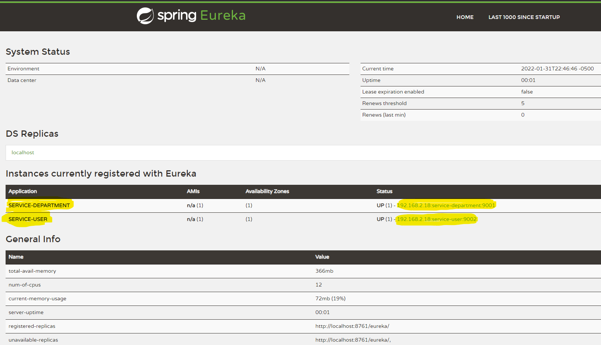

# Microservice Model

This project is a microservice model that may be used as a prototype for futures microservice projects. It has two microservices: Department and User. The root project is a Spring Boot project. The microservices and the Service Registry are ordinary Maven projects. Each microservice project is a submodule of the root project. Below you can see the final result.

```text
microservice (root project)
|   pom.xml
|   README.md
|
+---service-department (department microservice)
|   |   pom.xml
|   |   README.md
|   |
|   +---src (java code)
|
+---service-registry (service registry)
|   |   pom.xml
|   |   README.md
|   |
|   +---src (java code)
|
+---service-user (user microservice)
    |   pom.xml
    |   README.md
    |
    +---src (java code)
```

## Architecture


- User and department microservices - 2 simple microservices.
- Service Registry - All microservices are registered to the Service Registry. This serve manages all the service names and ports.
- API Gateway - It is a gateway for all APIs. All the requests should go to the API gateway. It is responsible to travel the requests to the right API.
- Hystrix Dashboard - Manage all API. Identify which microservice is or not working.

## Settings

### 1. Libs

Create a new Spring Boot project with the dependencies below:
- Spring Web
- Spring Data JPA
- Spring Cloud
  - Eureka
- Lombok
- H2

###### Root project pow.xml

The root [pom.xml](/pom.xml) has the Spring Boot `parent`, `<dependencyManagement>` and `build` tags. Those tags allow Maven to import Spring Boot dependencies on the submodules.
```xml
...
<parent>
    <groupId>org.springframework.boot</groupId>
    <artifactId>spring-boot-starter-parent</artifactId>
    <version>2.6.3</version>
    <relativePath/> <!-- lookup parent from repository -->
</parent>
...
<dependencyManagement>
    <dependencies>
        <dependency>
            <groupId>org.springframework.cloud</groupId>
            <artifactId>spring-cloud-dependencies</artifactId>
            <version>${spring-cloud.version}</version>
            <type>pom</type>
            <scope>import</scope>
        </dependency>
    </dependencies>
</dependencyManagement>
...
<build>
    <plugins>
        <plugin>
            <groupId>org.springframework.boot</groupId>
            <artifactId>spring-boot-maven-plugin</artifactId>
            <configuration>
                <excludes>
                    <exclude>
                        <groupId>org.projectlombok</groupId>
                        <artifactId>lombok</artifactId>
                    </exclude>
                </excludes>
            </configuration>
        </plugin>
    </plugins>
</build>
...
```

The `<spring-cloud.version>` tag is used to set the Spring Cloud version.

```xml
<properties>
    <maven.compiler.source>11</maven.compiler.source>
    <maven.compiler.target>11</maven.compiler.target>
    <spring-cloud.version>2021.0.0</spring-cloud.version>
</properties>
```

The `groupId`, `artifactId`, `version` and `<packaging>` has the root project identification.

```xml
<groupId>microservice</groupId>
<artifactId>microservice</artifactId>
<version>1.0</version>
<packaging>pom</packaging>
```

Also, the `modules` has the name for all submodules.

```xml
<modules>
    <module>service-department</module>
    <module>service-user</module>
    <module>service-registry</module>
</modules>
```

### 2. Services

Each service is a normal Maven project created as a submodule of the root project. The `<parent>` tag should point to the root project.

```xml
<parent>
    <groupId>microservice</groupId>
    <artifactId>microservice</artifactId>
    <version>1.0</version>
</parent>
```

###### Department Service pow.xml

The Department microservice [pow.xml](/service-department/pom.xml) has the `artifactId` tags detailed below

```xml
<artifactId>serviceDepartment</artifactId>
```

###### User Service pow.xml

The User microservice [pow.xml](/service-user/pom.xml) has the `artifactId` tags detailed below

```xml
<artifactId>serviceUser</artifactId>
```

Also, the User microservice has the tag `<dependency>` pointing to the root project. This is necessary to use objects from the Departament service.

```xml
<dependency>
    <groupId>microservice</groupId>
    <artifactId>serviceDepartment</artifactId>
    <version>1.0</version>
</dependency>
```

### 3. Swagger

- [Department Swagger](http://localhost:9001/departments/swagger-ui/index.html)
- [User Swagger](http://localhost:9002/users/swagger-ui/index.html)

# TODO: 

### 4. H2

To make H2 Console work, you have to change the property `spring.datasource.url` in the Spring boot file `application.properties` on both microservices. To access the H2 console use the url `/localhost:<port>/<serviceName>/h2` and the login `sa` and password `password`.

- [Department H2](http://localhost:9001/departments/h2)
- [User H2](http://localhost:9002/users/swagger-ui/h2)

User service in Windows:

```text
spring.datasource.url=jdbc:h2:mem:C:/Workspace-IntelliJ/microservice/service-user/userdb
```

User service in Linux (need validation):

```text
spring.datasource.url=jdbc:h2:mem:/home/ec2-user/userdb
```

Department service in Windows:

```text
spring.datasource.url=jdbc:h2:mem:C:/Workspace-IntelliJ/microservice/service-user/departmentdb
```

Department service in Linux (need validation):

```text
spring.datasource.url=jdbc:h2:mem:/home/ec2-user/departmentdb
```

### 5. Java OpenJDK 11

Installation and configuration in Linux.

```text
sudo yum update
sudo amazon-linux-extras install java-openjdk11
sudo yum isntall java-11-openjdk-devel
```

Check installation.

```text
java -version
javac -version
```

### 6. Service Registry

The Service Registry is a normal Maven project created as a submodule of the root project. The Service Registry [pow.xml](/service-registry/pom.xml) has the `<parent>` tag pointing to the root project.

Use the following URL to access the Spring Eureka console: [http://localhost:8761/](http://localhost:8761/)



```xml
<parent>
    <artifactId>microservice</artifactId>
    <groupId>microservice</groupId>
    <version>1.0</version>
</parent>
```

The `artifactId` tag is detailed below.
```xml
<artifactId>service-registry</artifactId>
```

The Service Registry [application.properties](/service-department/src/main/resources/application.properties) has the properties below.

```properties
server.port=8761
spring.application.name=eureka-server

eureka.client.register-with-eureka=false
eureka.client.fetch-registry=false
```

The Department [application.properties](/service-department/src/main/resources/application.properties) have the properties below.

```properties
spring.application.name=service-department

eureka.client.register-with-eureka=true
eureka.client.fetch-registry=true
eureka.client.service-url.defaultZone=http://localhost:8761/eureka
eureka.instance.hostname=localhost
```

The User [application.properties](/service-user/src/main/resources/application.properties) have the properties below.

```properties
spring.application.name=service-user

eureka.client.register-with-eureka=true
eureka.client.fetch-registry=true
eureka.client.service-url.defaultZone=http://localhost:8761/eureka/
eureka.instance.hostname=localhost
```

The bean `RestTemplate` in the class [Configurations](/service-user/src/main/java/com/serviceUser/configuration/Configurations.java) needs the annotation `@LoadBalanced`.
```java
@Configuration
public class Configurations {

    @Bean
    @LoadBalanced
    public RestTemplate getRestTemplate() {
        return new RestTemplate();
    }

}
```

The classes [ServiceDepartmentApplication](/service-department/src/main/java/com/serviceDepartment/ServiceDepartmentApplication.java) and [ServiceUserApplication](/service-user/src/main/java/com/serviceUser/ServiceUserApplication.java) needs the annotation `@EnableEurekaClient`.

```java
@SpringBootApplication
@EnableEurekaClient
@OpenAPIDefinition(...)
public class ServiceUserApplication { ... }
```

The classes [ServiceRegistryApplication](/service-registry/src/main/java/com/serviceRegisrtry/ServiceRegistryApplication.java) needs the annotation `@EnableEurekaServer`.

```java
@SpringBootApplication
@EnableEurekaServer
public class ServiceRegistryApplication { ... }
```

Now, the bean `restTemplate` can use the registered URL `http://service-department/` already mapped. You no longer need to take care with ports and service names anymore.

```java
Department department = restTemplate.getForObject("http://service-department/departments/" + user.getDepartmentId(),
```

# Resources

1. https://www.youtube.com/watch?v=p485kUNpPvE
1. https://www.youtube.com/watch?v=QWOgkI4DuE8
1. https://www.youtube.com/watch?v=-gLLeoS1m6s&t=233s
1. https://www.youtube.com/watch?v=C2NLPQTvO9M
1. https://www.youtube.com/watch?v=nFxjaVmFj5E
1. https://www.youtube.com/watch?v=BnknNTN8icw&t=2610s
1. https://www.baeldung.com/spring-boot-app-as-a-service
1. https://medium.com/@aleksanderkolata/java-tips-01-handle-validation-in-an-elegant-manner-using-chain-of-responsibility-design-pattern-ad3dcc22479e
