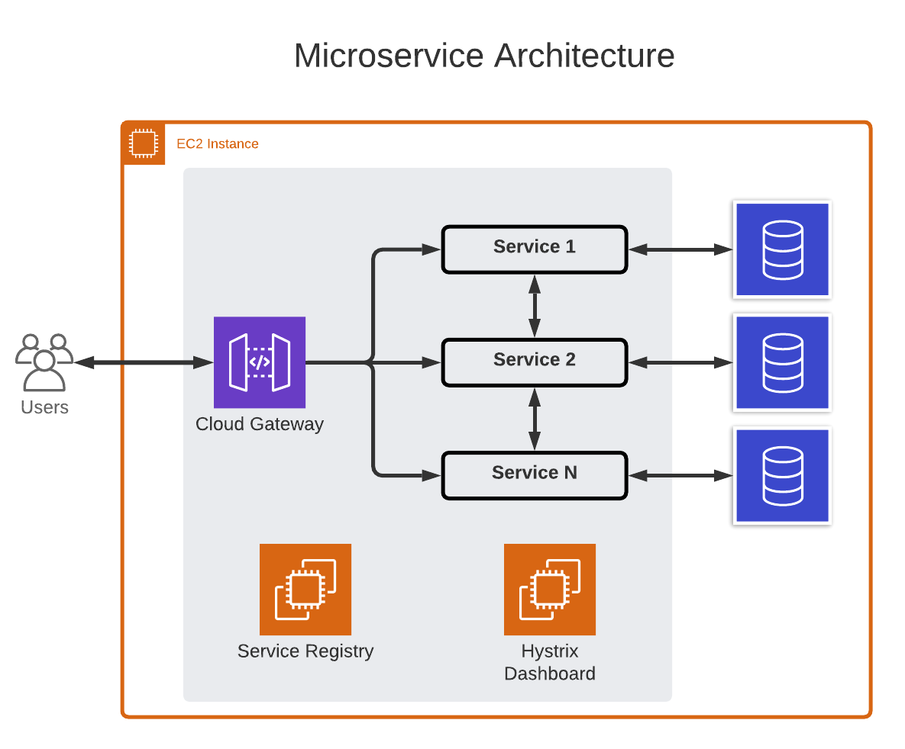

# Microservice Model

This is a model project for microservices using Spring Boot.

## Architecture



- Service Registry - All microservices are connected to the Service Registry.
- API Gateway - It is a gateway for all APIs. All the requests should go to this API gateway. It is responsible to travel the request to the right API.
- Hystrix Dashboard - Manage all API. Identify which microservice is or not working.

## Settings

### 1. Root Project

Create a new Spring Boot project with the dependencies below:
- Spring Web
- Spring Data JPA
- Lombok
- H2

###### Directories tree of the architecture
```aidl
microservice
|   pom.xml
|   README.md
```

###### Root project pow.xml
```XML
<?xml version="1.0" encoding="UTF-8"?>
<project xmlns="http://maven.apache.org/POM/4.0.0"
         xmlns:xsi="http://www.w3.org/2001/XMLSchema-instance"
         xsi:schemaLocation="http://maven.apache.org/POM/4.0.0 http://maven.apache.org/xsd/maven-4.0.0.xsd">
    <modelVersion>4.0.0</modelVersion>

    <parent>
        <groupId>org.springframework.boot</groupId>
        <artifactId>spring-boot-starter-parent</artifactId>
        <version>2.6.3</version>
        <relativePath/> <!-- lookup parent from repository -->
    </parent>

    <groupId>microservice</groupId>
    <artifactId>microservice</artifactId>
    <version>1.0</version>
    <packaging>pom</packaging>

    <modules>
        <module>service-department</module>
        <module>service-user</module>
    </modules>

    <properties>
        <maven.compiler.source>11</maven.compiler.source>
        <maven.compiler.target>11</maven.compiler.target>
    </properties>

    <dependencies>
        <!-- Swagger -->
        <dependency>
            <groupId>org.springdoc</groupId>
            <artifactId>springdoc-openapi-ui</artifactId>
            <version>1.6.4</version>
        </dependency>

        <dependency>
            <groupId>org.springframework.boot</groupId>
            <artifactId>spring-boot-starter-data-jpa</artifactId>
        </dependency>

        <dependency>
            <groupId>org.springframework.boot</groupId>
            <artifactId>spring-boot-starter-web</artifactId>
        </dependency>

        <dependency>
            <groupId>com.h2database</groupId>
            <artifactId>h2</artifactId>
            <scope>runtime</scope>
        </dependency>

        <dependency>
            <groupId>org.projectlombok</groupId>
            <artifactId>lombok</artifactId>
            <optional>true</optional>
        </dependency>

        <dependency>
            <groupId>org.springframework.boot</groupId>
            <artifactId>spring-boot-starter-test</artifactId>
            <scope>test</scope>
        </dependency>
    </dependencies>

    <build>
        <plugins>
            <plugin>
                <groupId>org.springframework.boot</groupId>
                <artifactId>spring-boot-maven-plugin</artifactId>
                <configuration>
                    <excludes>
                        <exclude>
                            <groupId>org.projectlombok</groupId>
                            <artifactId>lombok</artifactId>
                        </exclude>
                    </excludes>
                </configuration>
            </plugin>
        </plugins>
    </build>

</project>
```

The configuration below is the Spring Boot settings.
```xml
<parent>
    <groupId>org.springframework.boot</groupId>
    <artifactId>spring-boot-starter-parent</artifactId>
    <version>2.6.3</version>
    <relativePath/> <!-- lookup parent from repository -->
</parent>
.
.
.
<build>
    <plugins>
        <plugin>
            <groupId>org.springframework.boot</groupId>
            <artifactId>spring-boot-maven-plugin</artifactId>
            <configuration>
                <excludes>
                    <exclude>
                        <groupId>org.projectlombok</groupId>
                        <artifactId>lombok</artifactId>
                    </exclude>
                </excludes>
            </configuration>
        </plugin>
    </plugins>
</build>
```

The configuration below is the microservices settings. We are creating two microservices `<module>service-department</module>` and `<module>service-user</module>`.
```xml
<groupId>microservice</groupId>
<artifactId>microservice</artifactId>
<version>1.0</version>
<packaging>pom</packaging>

<modules>
    <module>service-department</module>
    <module>service-user</module>
</modules>
```

### 2. Services

- [Department](/service-department/pom.xml)
- [User](/service-user/pom.xml)

Create a two new Maven projects. Do not create a Spring Boot project, create a simple Maven project. Create the projects `service-department` and `service-user` as submodules.

###### Directories tree of the architecture
```aidl
microservice
\---service-department
\---service-user
|   pom.xml
|   README.md
```

###### Department Service pow.xml

```xml
<?xml version="1.0" encoding="UTF-8"?>
<project xmlns="http://maven.apache.org/POM/4.0.0" xmlns:xsi="http://www.w3.org/2001/XMLSchema-instance"
         xsi:schemaLocation="http://maven.apache.org/POM/4.0.0 https://maven.apache.org/xsd/maven-4.0.0.xsd">
    <modelVersion>4.0.0</modelVersion>

    <parent>
        <groupId>microservice</groupId>
        <artifactId>microservice</artifactId>
        <version>1.0</version>
    </parent>

    <artifactId>serviceDepartment</artifactId>
    <version>1.0</version>

    <properties>
        <java.version>11</java.version>
    </properties>

</project>
```
The Department Service pow has the tag `<parent>` pointing to the root project.

###### USer Service pow.xml

```xml
<?xml version="1.0" encoding="UTF-8"?>
<project xmlns="http://maven.apache.org/POM/4.0.0" xmlns:xsi="http://www.w3.org/2001/XMLSchema-instance"
         xsi:schemaLocation="http://maven.apache.org/POM/4.0.0 https://maven.apache.org/xsd/maven-4.0.0.xsd">
    <modelVersion>4.0.0</modelVersion>

    <parent>
        <groupId>microservice</groupId>
        <artifactId>microservice</artifactId>
        <version>1.0</version>
    </parent>

    <artifactId>serviceUser</artifactId>
    <version>1.0</version>

    <properties>
        <java.version>11</java.version>
    </properties>

    <dependencies>
        <dependency>
            <groupId>microservice</groupId>
            <artifactId>serviceDepartment</artifactId>
            <version>1.0</version>
        </dependency>
    </dependencies>

</project>

```
The USer Service pow has the tag `<parent>` pointing to the root project and the tag `<dependency>`
```xml
<groupId>microservice</groupId>
<artifactId>serviceDepartment</artifactId>
<version>1.0</version>
```
pointing to user service. That is necessary to use objects from the Departament service. 

###### Directories tree of the architecture
```aidl
microservice
+---service-department
|   |   pom.xml
|   |   README.md
+---service-user
|   |   pom.xml
|   |   README.md
|   pom.xml
|   README.md
```

### 3. H2

To make H2 Console work, you have to change the property `spring.datasource.url` in the Spring boot file `application.properties` on both services. To access the H2 console use the url `<serviceName>/h2` and the login `sa` and password `password`.

User service Windows:
```
spring.datasource.url=jdbc:h2:mem:C:/Workspace-IntelliJ/microservice/service-user/userdb
```

User service Linux:
```
spring.datasource.url=jdbc:h2:mem:/home/ec2-user/userdb
```

Department service Windows:
```
spring.datasource.url=jdbc:h2:mem:C:/Workspace-IntelliJ/microservice/service-user/departmentdb
```

Department service Linux:
```
spring.datasource.url=jdbc:h2:mem:/home/ec2-user/departmentdb
```

### 3. Java OpenJDK 11

```aidl
sudo yum update
sudo amazon-linux-extras install java-openjdk11
sudo yum isntall java-11-openjdk-devel
```

Check installation
```aidl
java -version
javac -version
```
